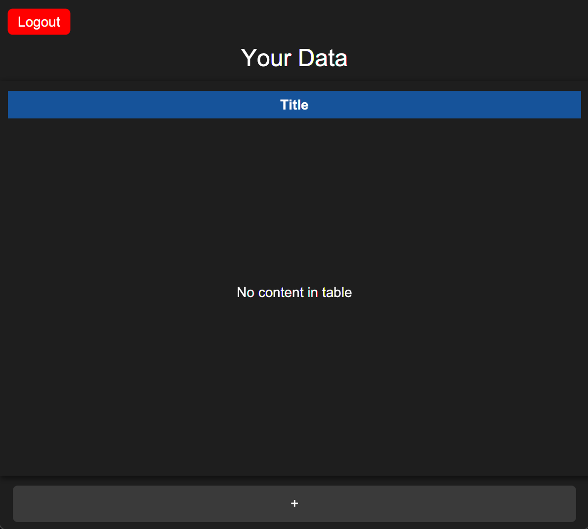

# Password manager

Cel projektu

Celem projektu jest stworzenie Password Managera, czyli aplikacji, która umożliwia użytkownikowi bezpieczne przechowywanie, zarządzanie i generowanie haseł. Program ma zapewniać wysoki poziom bezpieczeństwa danych dzięki zastosowaniu szyfrowania oraz prosty i intuicyjny interfejs użytkownika.

Funkcjonalności
1) Rejestracja i logowanie użytkownika
    Tworzenie nowego konta użytkownika.
    Logowanie do aplikacji przy użyciu hasła głównego (master password), które nie jest przechowywane w formie jawnej (użycie funkcji skrótu, np. SHA-256).
   
    Okno przy uruchomiemiu programu
   
   
   
    Okno rejestracji konta
   
   

2) Przechowywanie haseł
    Dodawanie nowych haseł do bazy danych (np. login, hasło, URL strony).
    Odczyt zapisanych haseł po uwierzytelnieniu użytkownika.
    Usuwanie lub edytowanie istniejących wpisów.
   
   Okno po zalogowaniu
   
   

   Okno dodawania danych do tablicy
   
   
   
   Przegląd konkretnych danych
   
   

3) Interfejs
    Interfejs aplikacji został stworzony przy użyciu biblioteki JavaFX z wykorzystaniem stylizacji za pomocą CSS, co zapewnia intuicyjną i estetyczną obsługę.
3) Generowanie haseł
    Moduł generujący silne hasła.
   
5) Moduł szyfrownia i kodowanie danych.
    W projekcie wykorzystujemy hybrydowe szyfrowanie z zastosowaniem algorytmów RSA oraz AES-GCM, co łączy bezpieczeństwo szyfrowania asymetrycznego (RSA) z wydajnością szyfrowania symetrycznego (AES). Dane użytkowników przechowywane są w bazie danych SQL, która zawiera kolumny: name, password oraz klucz RSA (publiczny do szyfrowania i prywatny do deszyfrowania). Każde konto ma swój unikalny klucz RSA.

    Dane użytkownika (takie jak title, login, password oraz data ostatniej modyfikacji) są przechowywane w osobnej tabeli w zaszyfrowanej postaci za pomocą AES-GCM oraz zakodowane w formacie Base64. Wszystkie dane są zabezpieczone przed nieautoryzowanym dostępem.

    W praktyce baza danych musi być przechowywana na zdalnym serwerze. Program wysyła żądania do serwera w celu weryfikacji użytkownika oraz pobierania danych, które są dynamicznie ładowane do aplikacji i odświeżają zawartość tabel w czasie rzeczywistym.

Projekt zapewnia bezpieczeństwo danych i wygodę użytkowania dzięki nowoczesnym rozwiązaniom szyfrowania i intuicyjnemu interfejsowi.
Jeszcze mieliśmy pomysł na broninie od BrutForce, ale nie zmogliśmy tego realizować.

Ivan Tymoshchuk 321749

Hleb Yazvinski 316794

